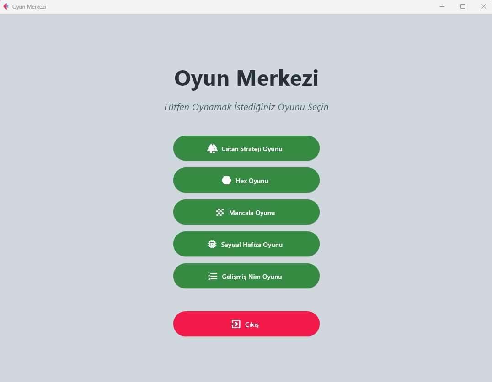
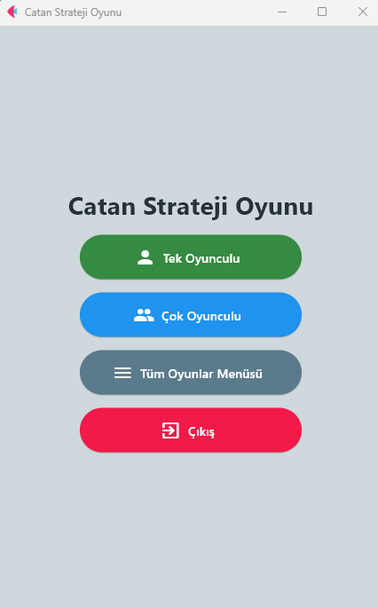
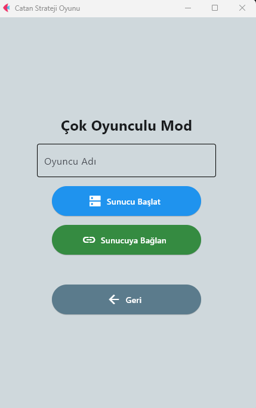
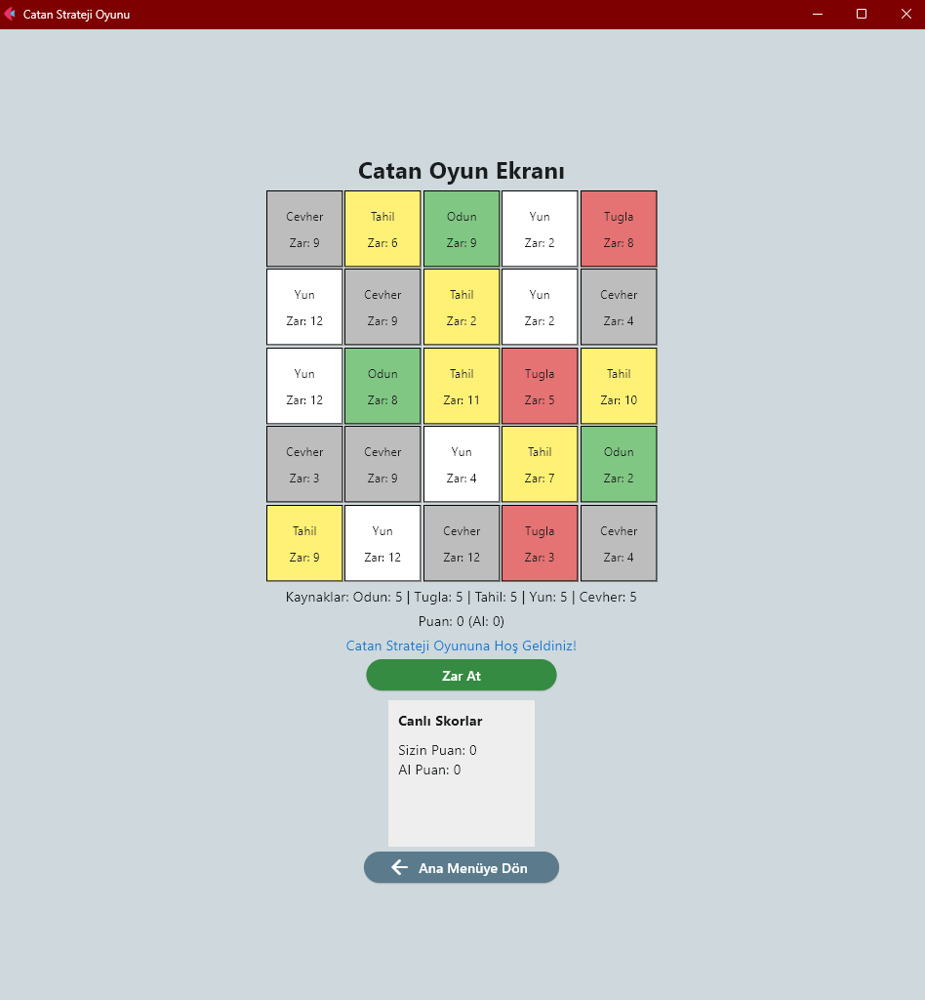
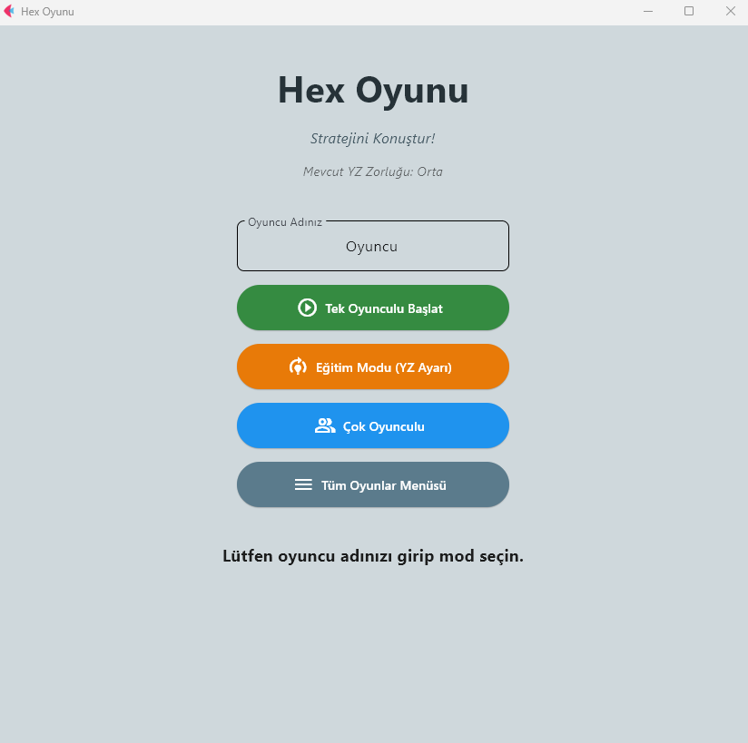
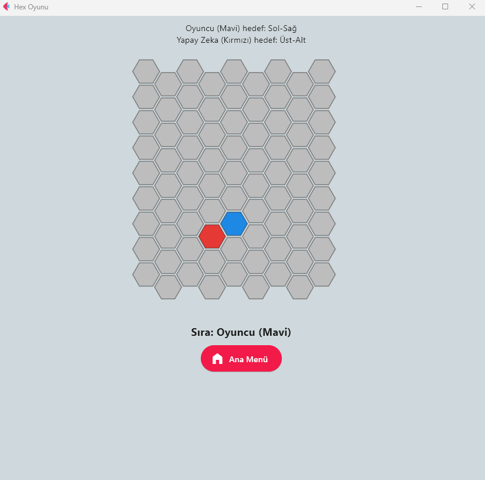
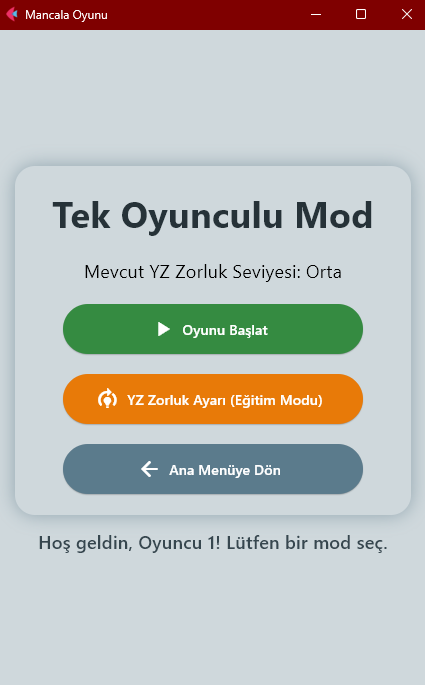
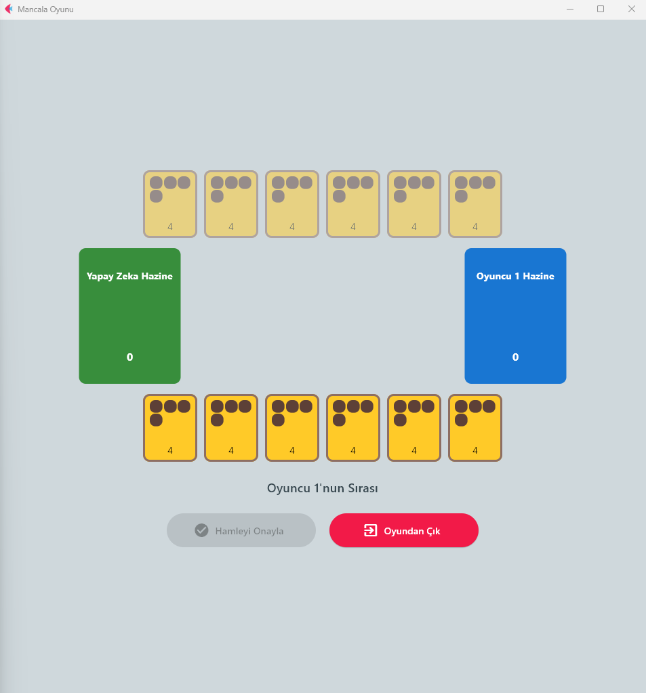
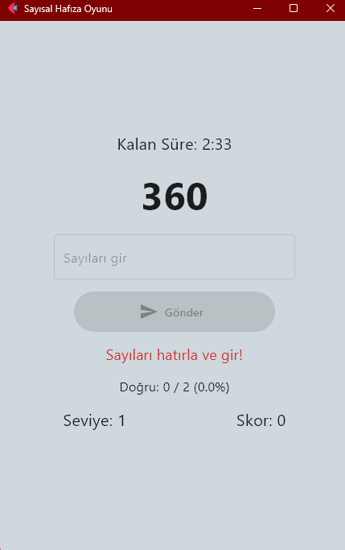
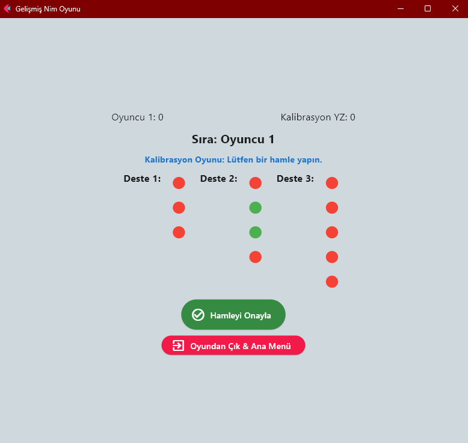

# 🎮 Oyun Merkezi

**Oyun Merkezi**, Python ve **Flet** kütüphanesi kullanılarak geliştirilmiş kapsamlı bir masaüstü oyun platformudur. Tek bir uygulama üzerinden farklı zeka oyunlarını bir arada sunar ve hem tek oyunculu hem de çok oyunculu mod desteği sağlar.  

Bu projeyi diğerlerinden ayıran en önemli özellik, tüm oyunların **yapay zeka destekli dinamik zorluk sistemi** ile çalışmasıdır. Oyuncular klasik oyunlarda olduğu gibi zorluk seviyesini kendileri seçmek zorunda kalmaz. Bunun yerine yapay zeka, oyuncunun davranışlarını, hamlelerini ve oyun içi performansını analiz ederek uygun seviyeyi otomatik olarak belirler. Böylece her oyuncu, kendi seviyesine en uygun rakiple karşılaşır, sıkılmadan gelişimini sürdürür ve rekabetin heyecanını en üst düzeyde yaşar.  

Ayrıca bu proje teknik olarak da dikkat çekicidir. **Flet**, aslında bir oyun motoru değil, kullanıcı arayüzü geliştirme kütüphanesidir. Ancak bu projede yaratıcı bir şekilde kullanılarak çoklu oyun deneyimi sunan bir oyun merkezi haline getirilmiştir. Bu yaklaşım sayesinde oyunlar yalnızca Windows üzerinde değil, aynı zamanda **Android, iOS, tarayıcı ve masaüstü ortamlarında da uyumlu** bir şekilde çalışabilmektedir. Bu özellik, projeyi bu alanda türünün ilk örneklerinden biri yapmaktadır.  

---

## 🚀 Kurulum  

### 1. Repository’yi klonlayın  
```bash
git clone <repository-url>
cd oyun-merkezi
```

### 2. Gerekli kütüphaneleri yükleyin  
```bash
pip install flet
```

### 3. Uygulamayı başlatın  
```bash
python birleştirme_2.py
```

### 4. Paketleme (Opsiyonel)  
```bash
pyinstaller Oyun_Merkezi.spec
```

---

## 📸 Genel Görünüm  

  

---

## 🧠 Yapay Zeka Destekli Dinamik Zorluk Sistemi  

Oyun Merkezi’nin kalbinde, **dinamik zorluk ayarlama mekanizması** bulunur. Oyuncunun oyun esnasındaki performansı sürekli izlenir ve analiz edilir. Böylece her oyuncu, kendi seviyesine göre eşleşmiş bir yapay zekaya karşı mücadele eder.  

- Oyuncuların seviyelerini elle seçmesine gerek kalmaz.  
- Yapay zeka, test oyunları veya doğrudan oyun içindeki hamleler aracılığıyla seviye belirler.  
- Bu sistem her oyunda farklı şekilde uygulanarak oyunculara özgün deneyimler sunar.  

Aşağıda her bir oyunun detaylı açıklaması yer almaktadır.  

---

## 🌲 Catan Strateji Oyunu  

  
  
  

Catan Strateji Oyunu, yapay zekanın en yoğun şekilde hissedildiği bölümlerden biridir. Oyun sırasında yapılan her hamle ayrı ayrı değerlendirilir ve zorluk seviyesi gerçek zamanlı olarak güncellenir. Bu, oyuncunun daha önceki hamlelerinden öğrenen ve seviyesini ona göre adapte eden bir sistemdir.  

Bu yaklaşım, her oyunun farklı bir deneyim sunmasını sağlar. Örneğin, oyuncu basit stratejilerle ilerliyorsa yapay zeka fazla baskı kurmaz; fakat daha ileri seviye hamleler yapıldığında yapay zeka da buna uygun şekilde güçlenir.  

Catan oyunu hem tek oyunculu hem de çok oyunculu modlarda oynanabilir. Çok oyunculu mod, oyuncuların kendi stratejilerini karşılıklı denemelerine olanak verirken yapay zekanın sürekli adaptasyonu oyuna ekstra stratejik derinlik katar.  

---

## 🔷 Hex Oyunu  

  
  

Hex, stratejik düşünmenin ön planda olduğu klasik bir zeka oyunudur. Bu projede kullanılan yapay zeka oldukça gelişmiş bir mantığa sahiptir. Oyuncunun hamleleri kolay ve tahmin edilebilir olduğunda, yapay zeka da basit hamleler yaparak oyuncunun oyundan kopmamasını sağlar. Ancak oyuncu karmaşık ve yaratıcı stratejiler geliştirdiğinde yapay zeka da aynı seviyede karşılık verir.  

Böylece Hex oyunu her oyuncuya kendi seviyesinde bir rakip sunar. Tek oyunculu, eğitim modu (yapay zekanın farklı davranışlarını deneyimlemek için) ve çok oyunculu mod seçenekleri mevcuttur.  

---

## 🏺 Mancala Oyunu  

  
  

Mancala’da zorluk belirleme sistemi diğer oyunlardan farklıdır. Oyuncu başlangıçta bir test oyunu oynar ve yapay zeka bu test oyununu analiz ederek kalıcı bir seviye belirler.  

- Oyuncu tekrar manuel olarak değiştirmediği sürece aynı seviyede kalır.  
- Eğer oyun içinde oyuncunun yeteneklerinde belirgin bir değişim gözlenirse sistem oyuncuya yeniden test oyunu oynaması gerektiğini bildirir.  

Bu yaklaşım, Mancala’yı özellikle gelişim odaklı bir oyun haline getirir. Oyuncular seviyelerini test ederek daha iyi rakiplerle karşılaşma şansı bulurlar. Tek ve çok oyunculu modlarla desteklenen oyun, strateji sevenler için güçlü bir seçenek sunar.  

---

## 🔢 Sayısal Hafıza Oyunu  

  

Sayısal Hafıza Oyunu, hafıza yeteneğini ölçen ve geliştiren dinamik bir sistem üzerine kuruludur. Oyun üç basamaklı sayılarla başlar ve oyuncu doğru cevap verdikçe hem basamak sayısı hem de zorluk artar.  

- Her üç doğru cevaptan sonra basamak sayısı artar.  
- Yanlış cevap verildiğinde ilerleme durur ve aynı seviyede kalınır.  
- Yapay zeka doğru cevap verdikçe süreyi kısaltır, yanlış cevapta ise süreyi uzatır.  

Bu sistem, hızlı düşünen oyuncular için bir avantaj yaratırken daha yavaş oyunculara da oyun içinde fırsat tanır. Online çok oyunculu modda bu mekanizma rekabeti daha da heyecanlı hale getirir: doğru ve hızlı cevaplayan oyuncular daha yüksek skor elde ederek avantaj kazanır.  

---

## ➕ Gelişmiş Nim Oyunu  

  

Gelişmiş Nim, klasik Nim oyunundan farklı ve çok daha stratejik bir deneyim sunar. Oyun desteleri her turda rastgele belirlenir ve oyunculara özgün bir oyun düzeni sunar.  

- Yanlış veya klasik kurallara aykırı hamleler -5 puan ceza getirir.  
- Doğru hamleler +5 puan kazandırır.  
- Son taşı alan oyuncu oyunu kazanır ve ek olarak +10 puan elde eder.  

Yapay zekanın rolü:  
- Nim oyununa başlanmadan önce oyuncu bir test oyunu oynar.  
- Yapay zeka bu test oyununu analiz ederek başlangıç seviyesini belirler.  
- Sonrasında asıl oyun bu seviyeye göre başlar.  

Bu mekanizma sayesinde oyuncular, klasik Nim oyununa kıyasla daha adil ve rekabetçi bir deneyim yaşar. Nim oyunu da tek oyunculu ve çok oyunculu modlarıyla geniş bir oyuncu kitlesine hitap eder.  

---

## 🗂️ Proje Yapısı  

```text
birleştirme_2.py     → Oyun merkezi ana kod dosyası
Oyun_Merkezi.spec    → PyInstaller spec dosyası (paketleme için)
icon.ico             → Uygulama ikonu
images/              → Ekran görüntüleri (ana menü, oyun ekranları)
README.md            → Proje açıklaması
```

---

## 🏆 Sonuç  

Oyun Merkezi, yapay zekayı yalnızca bir rakip olarak değil, aynı zamanda oyuncunun gelişimini destekleyen bir sistem olarak kullanan özgün bir projedir. Her oyun farklı bir yapay zeka mantığıyla çalışır ve oyuncuya kişiselleştirilmiş bir deneyim sunar.  

Tek oyunculu modda bireysel gelişim, çok oyunculu modda ise rekabet ön plandadır. Flet kütüphanesiyle geliştirilmiş olması, projeyi hem teknik açıdan hem de çoklu platform desteği açısından benzersiz kılmaktadır.  
